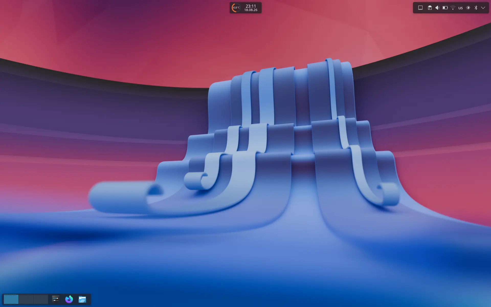
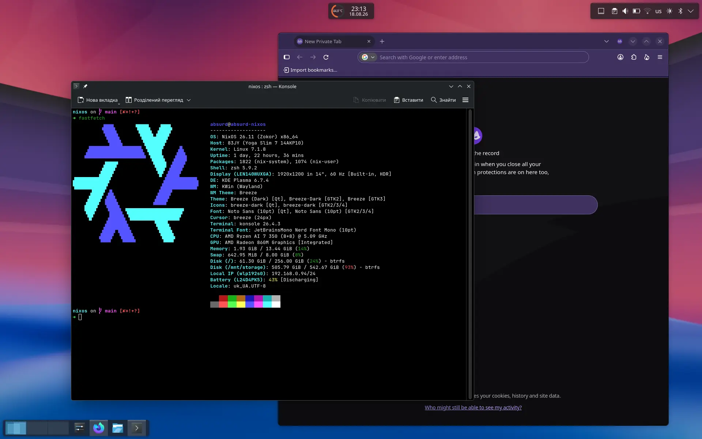
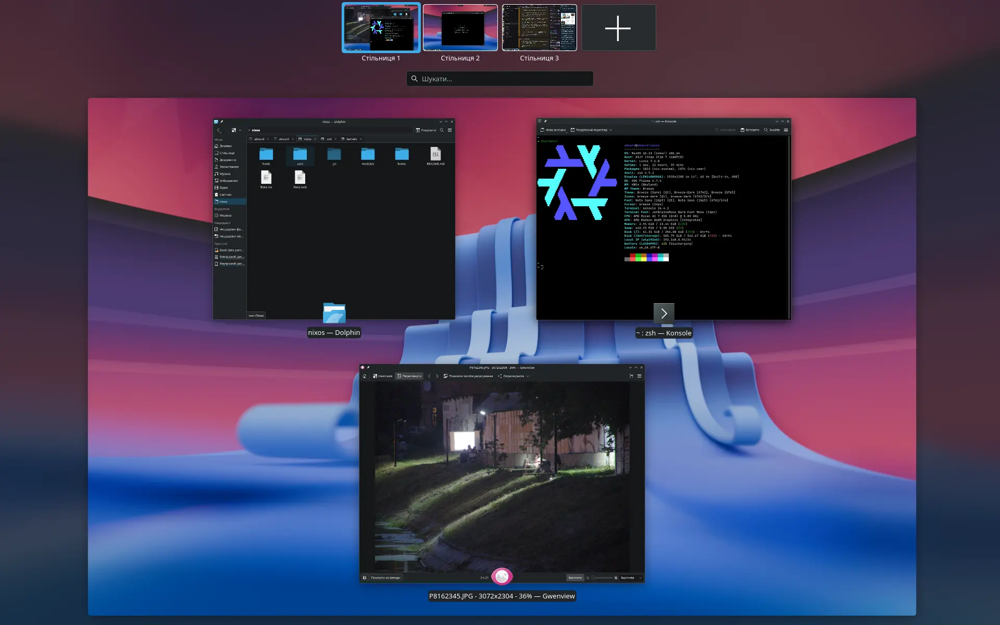

## absurdmushrooms' NixOS Configuration :snowflake:
This repository contains nix code that builds my system.

## Components

|                                                                | NixOS (Wayland)                                                                                                      |
| -------------------------------------------------------------- | ------------------------------------------------------------------------------------------------------------------- |
| Desktop environment                                        | KDE                                                                                                                 |
| Terminal Emulator                                          | Konsole                                                                                                             |
| Display Manager                                            | SDDM                                                                                                                |
| Theme                                                      | Breeze Dark                                                                                                         |
| Network management tool                                    | NetworkManager                                                                                                      |
| System resource monitor                                    | Btop++ / KDE System Monitor                                                                                         |
| File Manager                                               | Dolphin                                                                                                             |
| Shell                                                      | Zsh + Starship                                                                                                      |
| Media Player                                               | Haruna                                                                                                              |
| Editors / IDE                                              | Vim                                                                                                                 |
| Fonts                                                      | Nerd fonts for Konsole / Default KDE fonts                                                                          |
| Image Viewer                                               | Gwenview                                                                                                            |
| Screenshot Software                                        | Spectacle                                                                                                           |
| Screen Recording                                           | OBS                                                                                                                 |
| Filesystem                                                 | Btrfs subvolumes                                                                                                    |
| Secure Boot                                                | Limine                                                                                                                

## Screenshots

## References

Other dotfiles that inspired me:

- Nix Flakes
  - [ryan4yin/nix-config/](https://github.com/ryan4yin/nix-config/)
- Modularized NixOS Configuration
  - [AlexAntonik/config/](https://github.com/AlexAntonik/config/)
